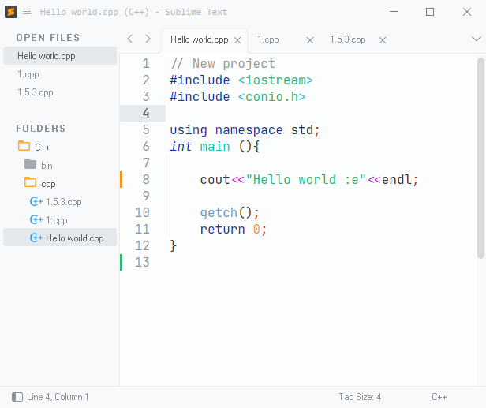

# C++ build system for Sublime Text.

Compile and run in a external terminal. Only for Windows.

INFORMACIÓN:

Es de autoría propia y el que mejor me ha servido.

IMPORTANTE:

Si revisaron el archivo verán que hay dos códigos, ambos funcionan igual, la única diferencia se encuentra en donde se guarda el programa compilado.

1. DEFAULT SYSTEM BUILT:
Guarda el programa en la misma carpeta donde se encuentra el archivo. Si cuando programas usas pocos archivos está es la mejor opción. Caso contrario te puede interesar el segundo código.

2. SECOND SYSTEM BUILT:
Se encarga de guardad el programa compilado en una carpeta diferente. Este es el sistema de compilación que yo uso, me permite ordenar mejor mis diferentes archivos.

Explicación minusciosa del código:

                "$folder/bin/$file_base_name.exe"

- "$folder": hace referencia a la carpeta general del proyecto. Como verán en la captura de pantalla, mis archivos se encuentran en la carpeta "cpp", pero la carpeta general es "C++".

- "/bin/": hace referencia a la carpeta donde se guardan los programas. "bin" es un nombre aleatorio que yo mismo puse y puede ser cambiado por cualquier otro nombre, eso sí, aseguranse de crear primero la carpeta junto a su carpeta de archivos.

