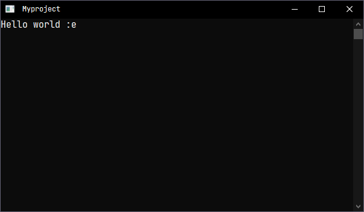
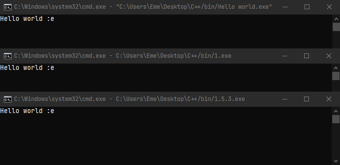

# Sublime Text C++ build system

Compila y ejecuta archivos C++ en Sublime Text. Para Windows y Ubuntu.

Compile and run C++ file in Sublime Text. Windows and Ubuntu.

## Este documento contiene información importante del código

El código lo comparto para hacer más fácil el trabajo y aprendizaje de las personas interesadas en aprender el lenguaje de programación C++.

En primer lugar, el código es de autoría propia, hecho y re-hecho y el que mejor me ha servido. El documento no es una guía profesional, sino más bien un conjunto de recomendaciones y curiosidades que puede usar para crear, compilar y ejecutar sus programas, haciendo su experiencia programando en C++ más anema.

El *Sistem Build* está disponible para Windows y Ubuntu, el código tiene pequeñas diferencias para distintos sistemas operativos, sin embargo, para este documento me centro más en la explicación del compilador para Windows, si están interesados puedo hacer una guía igual para Ubuntu.

### **IMPORTANTE:**

Si revisaron el archivo (windows.sublime-build) o (ubuntu.sublime-build) verán que hay dos códigos, ambos funcionan igual, la única diferencia se encuentra en donde se guarda el programa compilado.

**1. DEFAULT BUILD SYSTEM:**

Guarda el programa en la misma carpeta donde se encuentra el archivo. Si cuando programas usas pocos archivos está es la mejor opción.

Caso contrario te puede interesar el segundo código.

**2. SECONDARY BUILD SYSTEM:**

Se encarga de guardar el programa compilado en una carpeta diferente. Este es el sistema de compilación que yo uso, me permite ordenar mejor mis diferentes archivos.

**Cómo funciona lo de guardar en otra carpeta:**

Todo es gracias a esta parte del código:

                "$folder/bin/$file_base_name.exe"
Primero explicaré un poco el código, para qué tengas en cuenta lo que necesitas para usar esta opción:

**"$folder/bin/"**: Es la dirección en donde se guarda el archivo compilado y de donde se ejecutará el programa. Si te das cuenta, leyendo ambos códigos, esta parte es la única que cambia, pero permite una organización de archivos diferente u ordenada.

**"$folder"**: hace referencia a la carpeta general del proyecto. Como verán en la captura de pantalla, mis archivos se encuentran en la carpeta "cpp", pero la carpeta general es "C++", el comando hacer referencia a esa misma carpeta.

**"/bin/"**: hace referencia a la carpeta donde se guardan los programas. "bin" es un nombre aleatorio que yo mismo puse y puede ser cambiado por cualquier otro nombre, eso sí, aseguranse de crear primero la carpeta junto a su carpeta de archivos.

Si quieres usar esta opción, debes asegurarte de crear una carpeta general, dentro debes crear dos carpetas uno para los archivos y otra para los programas (el nombre puede ser cualquier, pero asegúrate de cambiar en el código).

Así mismo, puedes crear una carpeta dentro de tu carpeta de archivos y cambiar el código, tal que así:

                "$folder/cpp/bin/$file_base_name.exe"
    
En mi caso, mi carpeta de archivos es "cpp" y dentro he creado una carpeta "bin" entonces, ahí se guardarán los programas.

### **COMPILAR:**

Una vez que terminas de crear tu archivo " .cpp", el siguiente paso es compilarlo, y para ello, se usa el siguiente comando:

                "g++", "$file_name", "-o", "$file_path/$file_base_name.exe"

Esta linea de código, permite que tu archivo " .cpp" pase a ser un programa ejecutable " .exe"; en pocas palabras eso es compilar. Muy bien, para ello necesitaremos tener los compiladores ya instalados en nuestra pc, y haber agregado la carpeta donde están los compiladores en la variable de entorno "path". Para obtener los archivos puedes usar Mingw, buscar en internet el que mejor se ajuste a tu entorno de trabajo y cómo instalarlo correctamente.

Explicaré un poco el código:

**"g++"**: Es el compilador que vamos a usar para transformar, por así decirlo, nuestros archivos " .cpp" a ejecutables " .exe".

**"$file_name"**: Es el nombre del archivo a compilar, en otras palabras, el archivo con el que talvez te encuentras trabajando.

**"-o"**: Significa "renombrar", permite cambiar el nombre y extensión del archivo.

**"$file_path/$file_base_name.exe"**: Es la dirección donde se guardará el programa y el nombre completo del mismo.

Cabe mencionar, que en el código original, entre "g++" y "$file_name" se encuentran 2 herramientas. La forma literaria correcta de expresar sería la siguiente:

                 "g++", [...] "$file_name"
                
Para una mejor explicación de este tema, he decidido ocultarlas. Las mismas serán explicadas a continuación:

### **OPCIONES GENERALES**:

Cuando se llama al compilador gcc, g++, etc., normalmente realiza el preprocesamiento, la compilación, el ensamblaje y la vinculación. Las "opciones generales" o mejor conocidas como **"overall options"**, le permiten detener este proceso en una etapa intermedia, así también optimizar y resaltar debidos procesos.

En resumen, son herramientas que permiten crear un entorno seguro donde correrá nuestro programa, te dan control sobre los diferentes procesos a la hora de ejecutar.

Para el código que vamos a usar, he agregado uno, que me parece importante: 

**"-Wall"**: Es la abreviatura de "warn all"; activa algunas advertencias que g++ puede informarle sobre su compilado. Por lo general, es una buena idea, especialmente si es un principiante, porque comprender y corregir esas advertencias puede ayudarlo a solucionar muchos tipos diferentes de problemas en su código. (*Obtenido de [Stackoverflow](https://stackoverflow.com/questions/2408038/what-does-wall-in-g-wall-test-cpp-o-test-do)*)

Existen muchos tipos de "opciones generales", mientras siga aprendiendo sabrá cuáles son mejores para su entorno de trabajo y cuáles no, se pueden agregar un sin número de opciones. 

Este es un tema que no abarcaré a profundidad, porque depende mucho de la necesidad, el tipo de programa, el número de tareas, la extensibilidad, etc., que se use en su proyecto. Sea el caso, en la siguiente página [Linux die net](https://linux.die.net/man/1/gcc) encontrará más información (*demasiada*).

Ahora bien, el siguiente no es una herramienta en sí, sino más bien, una etiqueta:

Obtenido de [Riptutorial](https://riptutorial.com/cplusplus).

**"stc=c++17"**: Esto representa la versión del compilador que se está usando. "C++17" es la versión estable actual y "C++20" es la versión en desarrollo. Puede cambiar a cualquier versión siempre que tenga las actualizaciones correspondientes. En caso que no le funcione el código, puede que sea por esto, asegúrese de tener actualizado su fichero.

"C++17" y "C++20" implementan características nuevas que están enfocadas a programas/programadores de muy alto nivel. Por lo que, usar otra versión no genera ningún inconveniete a la hora de programar. La versión estándar y la más usada es "C++11" de 2011 y "C++14" de 2014.

Si desea modificar el código, debería quedarle así:

Para la versión de 2011:

                "g++", "-Wall", "-std=c++11", "$file_name"
                
Para la versión de 2014:
              
                "g++", "-Wall", "-std=c++14", "$file_name"

Si está empezando, dejarlo así por defecto es la mejor opción. Para más información puede consultar los siguientes enlaces [cppreference.com](https://en.cppreference.com/w/cpp/language/history) y [GeeksforGeeks](https://www.geeksforgeeks.org/history-of-c/)

### **TERMINAL EXTERNO (WINDOWS):**

Como ya muchos sabrán, Sublime Text, tiene una consola integrada, el problema con esta consola es que no permite insertar datos, haciendo imposible interactuar con nuestros programas. Por eso, la mejor opción es usar la consola externa o "cmd".

Muy bien, el código llama una consola externa que ejecuta el programa antes compilado, en este casco, la orden es:

                "&&", "start", "cmd eme", "$file_path/$file_base_name.exe"
                
Bien, vamos explicando lo más importante:

**"&&"**: Significa "y", permite conectar el código. En otras palabras, gracias a este operador, podemos compilar y ejecutar nuestro programa.

**"star"**: Como el nombre lo dice, inicia la consola donde se ejecutará nuestro programa.

**"cmd eme"**: Es la consola que ejecuta el programa. La consola se llama "cmd eme" porque así la renombré yo. Pueden poner cualquier nombre, por ejemplo: "cmd /myproject" "cmd myproject", " myproject"), o dejar solo " ". Ten en cuenta que siempre hay un espacio en medio de las comillas dobles. Eso es lo que permite abrir una consola que puedes personalizar.

Si vas a poner otro nombre asegúrate de dejar un espacio después de la primera comilla, el código debería verse así:

                "&&", "start", " Myproject", "$file_path/$file_base_name.exe"
                
De esa forma se generará una consola con el nombre que hayas puesto y que se puede personalizar.

### **¿Porque renombrar la consola con la que trabajo?**

En pocas palabras porque es más cómodo. Esta consola la puedes editar a tu entorno de trabajo y gusto personal.
Dando click derecho en la parte superior de la ventana y yendo a "propiedades" puedes modificar el tamaño y posición de la ventana, el tipo, tamaño y color de la fuente y fondo. Y lo mejor, es que si abres un nuevo proyecto la consola seguirá siendo la misma, gracias a que los cambios se guardan en el registro del sistema, como un nuevo perfil.

Sin embargo, si quieres la consola por defecto, solo elimina "cmd eme", tal cual, tu código quede:

                "&&", "start", "$folder/bin/$file_base_name.exe"

De esta manera, tu programa se ejecutará en la consola predeterminada. No recomiendo esta opción porque sucede un error cuando vas a guardar un archivo.

Te explicaré en qué consiste y cómo se puede solucionar.

### **CÓMO NOMBRAR A TUS ARCHIVOS:**

Es importante la manera en cómo nombras a los archivos con los que trabajas y existen muchas formas de hacerlo.

No obstante, cuando se programa es posible que un compilador no sepa diferenciar entre "espacios", "puntos", "guiones", etc. Por lo que, cómo muchos sabrán, lo mejor es nombrar a tu archivo con guiones bajos, una sola palabra o nombre, como: main.cpp, myproject.cpp, mycat_and_mydog.cpp, A.cpp; o incluso con números: 1.cpp, 1_3.cpp.

Si nombras así tus archivos no tendrás problemas eliminando "cmd eme" (visto en la sección anterior) de tu código, ya que el compilador y la consola predeterminada podrán reconocer tu programa. Tú codigo puede quedar así sin ningún problema.
    
                "&&", "start", "$file_path/$file_base_name.exe"

Sin embargo, si eliminas el comando "cmd eme" y estás acostumbrado a nombrar a tus archivos de la siguiente manera: "My project.cpp", "ultimo intento.cpp", "Ejercicio 02.cpp" "1.5.3.cpp"; tendrás un problema, el archivo se compilará normalmente en tu fichero, **pero**, la consola por defecto no reconocerá el programa debido a que tiene espacios y si el nombre tiene puntos, te saldrá un error el cual no reconoce la extensión del fichero.

Ahora bien, **¿cómo soluciono este inconveniente?**

La respuesta obvia es, debes aprender a nombrar a tus archivos usando guiones bajos y nombres de una sola palabra o que estén unidos.

Por otro lado, puedes crear una consola personalizada (visto en la sección anterior). Esto a más de que se ve bonita y la puedes personalizar. Admite los nombres a los que estás acostumbrado, ya sea con guiones, puntos, espacios, etc., entonces, si no quieres lidiar con el problema de los nombres, tu código debería verse así:
               
               "&&", "start", " Myproject" "$folder/bin/$file_base_name.exe"
               
De esa forma podrás guardar, compilar y ejecutar tus programas sin ningún problema desde el editor de texto.

**Sin embargo**, si todavía deseas borrar "cmd eme", otra forma de solucionar este inconveniente es agregando el comando "call" a cualquiera de los dos códigos, así debería quedarte:

               "&&", "start", "call", "$folder/bin/$file_base_name.exe"

Este comando inicia la consola predeterminada y después hace un llamado a tu programa, en pocas palabras, puedes ejecutar tu programa así tenga un nombre con puntos o espacios.

El único problema (esto es un problema personal) es el extenso título que tiene la ventana.

Cómo podrán apreciar en la imagen anterior, el programa nos muestra la dirección completa de la consola y del programa que se ejecuta. Esto no es malo, es muy bueno si te interesa esa información, te permite saber de dónde se ejecuta el programa y puede ayudarte a tener un mejor control en tu trabajo. Además, también la puedes personalizar, son todas ventajas. A pesar de ello, prefiero una consola limpia, incluso en el título.

### **INSTRUCCIONES:**

Este proceso es para aquellos que tienen problemas a la hora usar el código. Cómo muchos, yo en un principio no sabía donde iba cada configuración, lo comparto para agilizar la instalación.

Para instalar el build systems se puede hacer de dos maneras:

**1. Crear un nuevo Build System:**

Lo primero es abrir Sublime Text, en herramientas, Build Systems, y la última opción "Nuevo Build System";

Esto te abrirá una nueva hoja de trabajo, borrás las líneas de código que están por defecto "{ "shell_cmd": "make" }" y a continuación, copias **uno** de los dos códigos presentes en el archivo "cmd_C++.sublime-build" y guardas.

Renombra a tu archivo cómo quieras, pero la extensión del mismo debe ser **" .sublime-build"**.

**2. Copiar el código descargado:**

La otra manera es descargando el archivo "windows.sublime-build" o "ubuntu.sublime-build" de este repositorio, y con el bloc de notas o el mismo Sublime text, eliminar el código que no vayas a usar y dejar uno de los dos. Una vez guardado, dirígete a la carpeta del controlador de paquetes de Sublime Text.

Ahí encontrarás una carpeta llamada "User" o "Usuario", si no tienes intaladas extensiones, será la única presente. Entra en la carpeta y pega el archivo. Puedes cambiarle el nombre a cómo te parezca más cómodo.

Ahora bien para ambos casos, reinicia Sublime Text y en Herramientas, Build System, encontrarás el tuyo con el nombre que hayas puesto, lo seleccionas y ya podrás compilar y ejecutar tus programas.

Para compilar en Sublime Text los atajos son la tecla "F7" o el comando "Ctrl+B" de manera predeterminada.

### INFORMACIÓN EXTRA:

Algunas curiosidades que todavía no he explicado del código:

**""file_regex": "^(..[^:]*):([0-9]+):?([0-9]+)?:? (.*)$",":** Permite capturar cuatro piezas de información en la salida (output): archivo, línea, columna y texto de error. En palabras sencillas si el programa detecta una incongruencia en tu código te notificará, véase el ejemplo:

Cómo te abrás percatado, he quitado el punto y coma ";", después del comando "getch()". El comentario en rojo es "file_regex" diciendo que ahí falta algo, caso contrario tu archivo no se compilará y muchos menos se ejecutará. Es una herramienta muy buena para dar con errores de tipeo. Puedes desactivarla si siempre escribes código de manera perfecta (sarcasmo). Pueden revisar el siguiente enlace para más información [Build Systems](https://www.sublimetext.com/docs/build_systems.html).

**"selector": "source.c++, source.c, source.cxx, source.cpp",**: Esta línea de código establece los archivos con los que trabajarás, lo normal sería tener solo "source.cpp", no obstante, se puede guardar archivos con esas diferentes extensiones.

**"shell": true,**: Una linea de comando muy importante, dejarla por defecto, permite que se ejecute la consola externa.

**"working_dir": "$file_path",**: Es la dirección en la que me encuentro trabajando, ojo, referencia la dirección del archivo " .cpp", y no el ejectuable " .exe".

No la agregué al código original, pero tiene su importancia:

**"encoding": "utf-8",**: Esta línea de código no está en el original, sin embargo, si desea incluirla puede hacerlo sin ningún problema. "utf-8" Es el tipo más popular de codificación Unicode, si sabes del tema, puedes agregar y cambiar a "utf-16", "uft-32", dependiendo de tus necesidades. Más información aquí [Definición UTF](https://techlib.net/definition/utf.html).

Lo recomendable es dejar el código original tal cómo está, debido a que, el mismo Sublime Text, te dará una u otra opción, y por defecto, viene configurado "utf-8".

## **OBSERVACIONES & CURIOSIDADES:**

- Si modifican algo del código y no arranca, revisen las comas, comillas, y llaves, son los principales problemas a la hora de crear un Build System.

- Si eres nuevo programando y tienes errores a la hora de visualizar tus programas, por ejemplo, cuando se ejecuta la ventana se cierra al milisegundo. La solución es añadir nuevas librerías a tu código, está "stdlib" y "conio", cómo las mejores opciones, un ejemplo corto sería:

**conio**

        #include <iostream>
        #include <conio.h> // Librería conio
        using namespace std;
        
        int main (){
	
	        cout<<"Hello world :e"<<endl;

	        getch(); // Comando getch() 
 	        return 0;
        }
        
 **stdlib**
        
        #include <iostream>
        #include <stdlib.h> // Librería stdlib
        using namespace std;
        
        int main (){
	
	        cout<<"Hello world :e"<<endl;

	        system("pause"); // Comando system() 
 	        return 0;
        }
        
Esto evitará que tu programa se cierre al instante y te permitirá visualizar tus test, resultados, etc.

Esta opción es valida para Windows, si estás usando linux sabrás que no se instalan por defecto esas librerías, pero el mismo código está hecho para que no sea necesario el uso de las librerías, por lo que, puedes ejecutar tus programas con total normalidad.
 
 - Por cómo tengo configurado mi Sublime Text, el tema es "Ayu light", el color del esquema, layout, "scheme", etc; es breakers, pero está personalizado a gusto, "A file icon" es una extensión para visualizar mejor mis distintos archivos. La fuente que uso [JetBrains Mono](https://www.jetbrains.com/es-es/lp/mono/), la pueden obtener gratis, en lo personal una de las mejores para trabajar.

### GRACIAS.
