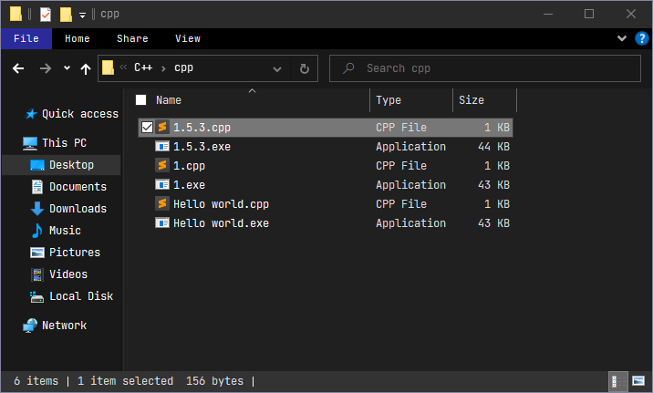

# C++ build system para Sublime Text

Compile and run in a external terminal. Only for Windows.

Compila y ejecuta en una terminal externa. Solo para Windows.

# Este documento contiene información importante del código

El código lo comparto para hacer más fácil el trabajo y aprendizaje de las personas interesadas en aprender el lenguaje C++.

En primer lugar, el código es de autoría propia, hecho y re-hecho y el que mejor me ha servido.

**IMPORTANTE:**

Si revisaron el archivo (cmd_C++.sublime-build) verán que hay dos códigos, ambos funcionan igual, la única diferencia se encuentra en donde se guarda el programa compilado.

1. DEFAULT BUILD SYSTEM:

Guarda el programa en la misma carpeta donde se encuentra el archivo. Si cuando programas usas pocos archivos está es la mejor opción.

Caso contrario te puede interesar el segundo código.

2. SECONDARY BUILD SYSTEM:

Se encarga de guardar el programa compilado en una carpeta diferente. Este es el sistema de compilación que yo uso, me permite ordenar mejor mis diferentes archivos.

**Cómo funciona lo de guardar en otra carpeta:**

Todo es gracias a esta parte del código:

                "$folder/bin/$file_base_name.exe"
Primero explicaré un poco el código, para qué tengas en cuenta lo que necesitas para usar esta opción:

"$folder/bin/": Es la dirección en donde se guarda el archivo compilado y de donde se ejecutará el programa. Si te das cuenta, leyendo ambos códigos, esta parte es la única que cambia, pero permite una organización de archivos diferente u ordenada.

"$folder": hace referencia a la carpeta general del proyecto. Como verán en la captura de pantalla, mis archivos se encuentran en la carpeta "cpp", pero la carpeta general es "C++", el comando hacer referencia a esa misma carpeta.

"/bin/": hace referencia a la carpeta donde se guardan los programas. "bin" es un nombre aleatorio que yo mismo puse y puede ser cambiado por cualquier otro nombre, eso sí, aseguranse de crear primero la carpeta junto a su carpeta de archivos.

Si quieres usar esta opción, debes asegurarte de crear una carpeta general, dentro debes crear dos carpetas uno para los archivos y otra para los programas (el nombre puede ser cualquier, pero asegúrate de cambiar en el código).

Así mismo, puedes crear una carpeta dentro de tu carpeta de archivos y cambiar el código, tal que así:

                "$folder/cpp/bin/$file_base_name.exe"
    
En mi caso, mi carpeta de archivos es "cpp" y dentro he creado una carpeta "bin" entonces, ahí se guardarán los programas.

**TERMINAL EXTERNO:**

Como sabrán el código llama una consola externa que ejecuta el programa ya compilado, en este casco, la orden es:

                "&&", "start", "cmd eme", "$folder/bin/$file_base_name.exe"
Bien, vamos explicando lo más importante:

"&&": Significa "y", permite conectar el código.

"star": Como el nombre lo dice, inicia la consola donde se ejecutará nuestro programa.

"cmd eme": Es la consola que ejecuta el programa. La consola se llama "cmd eme" porque así la renombré yo. Pueden poner cualquier nombre, por ejemplo: "cmd /myproject" "cmd myproject", " myproject"), o dejar solo " ". Ten en cuenta que siempre hay un espacio en medio de las comillas dobles. Eso es lo que permite abrir una consola que puedes personalzar. 

Si vas a poner otro nombre asegúrate de dejar un espacio después de la primera comilla, el código debería verse así:

                "&&", "start", " Myproject", "$folder/bin/$file_base_name.exe"
                
De esa forma se generará una consola con el nombre que hayas puesto y que se puede personalizar.

**¿Porque renombrar la consola con la que trabajo?**
En pocas palabras porque es más cómodo. Esta consola la puedes editar a tu entorno de trabajo. 
Dando click derecho en la parte superior de la ventana y yendo a "propiedades" puedes modificar el tamaño y posición de la ventana, el tipo y tamaño de la fuente y el color del fondo y la letra. Y lo mejor, es que si abres un nuevo proyecto, la consola seguirá siendo la misma. Debido a que los cambios se guardan en un registro del sistema, como un nuevo perfil.

Sin embargo, si quieres la consola por defecto, solo elimina "cmd eme", tal cual, tu código quede:

                "&&", "start", "$folder/bin/$file_base_name.exe"

De esta manera, tu programa se ejecutará en la consola predeterminada. No recomiendo esta opción porque sucede un error cuando vas a guardar un archivo.
Te explicaré en qué consiste y cómo se puede solucionar.

**QUÉ NOMBRE PONER A TUS ARCHIVOS:**

Es importante la manera en cómo nombras a los archivos con los que trabajas y existen muchas formas de hacerlo. Sin embargo, cuando se programa es posible que un compilador no sepa diferenciar entre "espacios", "puntos", "guiones", etc. Por lo que, cómo muchos sabrán, lo mejor es nombrar a tu archivo con guiones bajos, una sola palabra o nombre, como: main.cpp, myproject.cpp, mycat_and_mydog.cpp, A.cpp; o incluso con números: 1.cpp, 1_3.cpp.

Si nombras así tus archivos no tendrás problemas eliminando "cmd eme" (visto en la sección anterior) de tu código, ya que, el compilador y la consola por defecto podrán reconocer tu programa. Tú codigo puede quedar así sin ningún problema.
    
                "&&", "start", "$folder/bin/$file_base_name.exe"

Sin embargo, si eliminas el comando "cmd eme" y estás acostumbrado a nombrar a tus archivos de la siguiente manera: "My project.cpp", "ultimo intento.cpp", "Ejercicio 02.cpp" "1.5.3.cpp"; tendrás un problema, y es que la consola por defecto no reconocerá el programa debido a que tiene espacios y si tu nombre tiene puntos, te saldrá un error el cual no reconoce la extensión del fichero.

Ahora bien, ¿cómo soluciono este inconveniente?

La respuesta obvia es, debes aprender a nombrar a tus archivos usando guiones bajos y nombres de una sola palabra o que estén unidos.

Por otro lado, puedes crear una consola personalizada (visto en la sección anterior). Esto a más de que se ve bonita y la puedes personalizar. Admite los nombres a los que estás acostumbrado, ya sea con guiones, puntos, espacios, etc., entonces, si no quieres lidiar con el problema de los nombres tu código debería verse así:
               
               "&&", "start", " Myproject" "$folder/bin/$file_base_name.exe"
               
De esa forma podrás guardar, compilar y ejecutar tus programas sin ningún problema.

Y si todavía deseas borrar "cmd eme", otra forma de solucionar este inconveniente es agregando el comando "call" a cualquiera de los dos códigos, así debería quedarte:

               "&&", "start", "call", "$folder/bin/$file_base_name.exe"

Este comando inicia la consola predeterminada y después hace un llamado a tu programa, en pocas palabras, puedes ejecutar tu programa así tenga un nombre con puntos u espacios.

El único problema, (este es un problema personal), es el extenso título que tiene la ventana.

Cómo podrán apreciar en la imagen anterior, el programa nos muestra la dirección completa de la consola y del programa que se ejecuta. Esto no es malo, es muy bueno si te interesa esa información, te permite saber de dónde se ejecuta el programa y puede ayudarte a tener un mejor control en tu trabajo. Además, también la puedes personalizar, son todas ventajas. Sin embargo, prefiero una consola limpia, incluso en el título.

**INFORMACIÓN RELACIONADA:**

**INSTRUCCIONES:**

